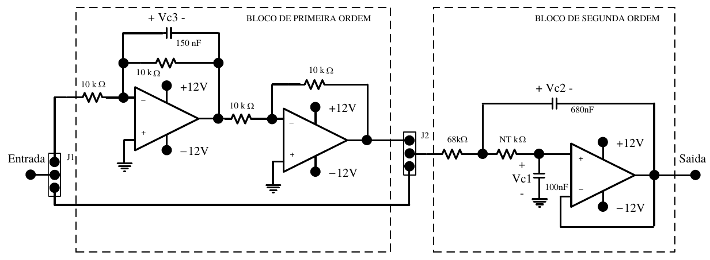

# Projeto de um sistema de controle digital no plano z pelo método do lugar das raízes

Este projeto tem por objetivo identificar e projetar um controlador digital no plano z pelo método do lugar das raízes utilizando uma planta conhecida. Buscando reduzir o tempo de acomodação e o sobre-sinal pela metade do seus respectivos valores. O circuito proposto é apresentado na figura 1.

Figura 1. Circuito proposto.

O arquivo [SCT_projeto_controlador_I_ADC_v3.m](SCT_projeto_controlador_I_ADC_v3.m) apresenta uma planilha de cálculo para a obtenção dos parâmetros. 

A pasta [STM32F103](./STM32F103) possui os arquivos do projeto do microcontrolador (um STM32F103), onde foi utilizado o software STMCube para a configuração do mesmo. 
